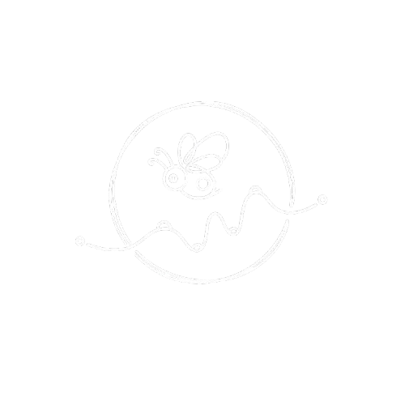

# FHIRFly: A HIPAA-Compliant Clinical Note Parser
### Built with Small Language Models (SLMs) on AWS
*(Project for the AWS SLM Build Day - 11/8/2025)*

<div align="center">
  
</div>

---

### 🎯 Problem Statement

Unstructured clinical notes (like discharge summaries) contain critical patient information, but this data is locked in free text. To use it for analytics, automation, or clinical dashboards, it must be parsed into a structured, queryable format (like JSON or FHIR).

However, two major blockers exist:
1.  **Privacy (HIPAA):** We **cannot** send Protected Health Information (PHI) to external, third-party LLM APIs.
2.  **Reliability & Cost:** General-purpose LLMs are often slow, expensive, and non-deterministic for a highly repetitive parsing task. We need a fast, reliable, and constrained parser.

Our project answers the question: **How can we build a fast, reliable, and HIPAA-compliant system to extract structured data from unstructured clinical notes?**

### 💡 Core Idea

Our solution is **FHIRFly**, a system that uses Small Language Models (SLMs) fine-tuned and hosted entirely within a secure AWS environment.

We built two core components:

1.  **A PII Redaction Model:** We fine-tuned a `TinyLlama-1.1B` model on a synthetic dataset (`clinical_notes_with_pii_added.csv`) to make it an expert at redacting personally identifiable information. This "cleans" the note while preserving all medical context.
2.  **A JSON Extraction App:** A Streamlit application that uses an SLM (with a highly-engineered prompt) to parse a clinical note into a clean, simplified JSON format, extracting key entities like `conditions` and `medications`.

This "student-teacher" and "specialist model" approach results in a small, fast, and cheap SLM that can be safely deployed inside a private VPC, processing notes at high speed without ever exposing PHI.

### 🚀 The Application: FHIRFly Streamlit App

The `streamlit/fhirfly.py` app provides an interactive front-end to demonstrate the JSON extraction capabilities.

<div align="center">
  </div>

#### Running the App

1.  Install the required dependencies:
    ```bash
    pip install -r requirements.txt
    ```
    *(Note: `requirements.txt` includes `streamlit`, `torch`, and `transformers`)*

2.  Run the Streamlit app:
    ```bash
    streamlit run streamlit/fhirfly.py
    ```

3.  Open your browser, paste in a clinical note, and see the structured JSON output in real-time.

### 🤖 The Model: Fine-Tuning for PII Redaction

The `finetune_model.py` script is the ML core of this project. It fine-tunes the `TinyLlama/TinyLlama-1.1B-Chat-v1.0` model on AWS Neuron-accelerated hardware.

The script is configured to:
* Load a synthetic dataset from an S3 bucket (`s3://.../clinical_notes_with_pii_added.csv`).
* Format the data into a "chat" conversation, where the user provides a note *with* PII, and the assistant returns the *redacted* note.
* Use LoRA (Low-Rank Adaptation) for efficient, PEFT-based fine-tuning.
* Leverage the `optimum.neuron.NeuronSFTTrainer` to train the model efficiently on AWS Trainium instances.

#### Training the Model

The model is trained by running the `finetune_model.py` script (typically on an AWS SageMaker instance):

```bash
python3 finetune_model.py \
    --model_id TinyLlama/TinyLlama-1.1B-Chat-v1.0 \
    --output_dir /opt/ml/model \
    --bf16 True \
    --lora_r 16 \
    --lora_alpha 32 \
    --max_steps 100 \
    --logging_steps 1 \
    --per_device_train_batch_size 4 \
    --per_device_eval_batch_size 4
```

### Links & Team

#### Links

- [AWS SLM Build Day](https://app.agihouse.org/events/smalllanguagemodel-20251108) — Event page
- [Slides](https://docs.google.com/presentation/d/1ecd6RZhQ8DfQl-gBviLd3fGVaSdELaiXxYqJxdbI2eo/edit?usp=sharing) — Presentation

#### The Team

| Name | Contact |
|---|---|
| Andrew Li | [ayl2159@columbia.edu](mailto:ayl2159@columbia.edu) |
| Jasmine Lo | [jl6973@columbia.edu](mailto:jl6973@columbia.edu) |
| Kirthana Natarajan | [kmn2161@columbia.edu](mailto:kmn2161@columbia.edu) |
| Yeshitha Bhuvanesh | [yb2649@columbia.edu](mailto:yb2649@columbia.edu) |